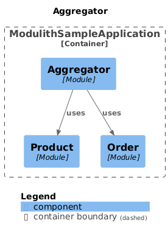

## Sample Spring Modulith

This project uses Spring Modulith in a little way with 2 domains (order and product) 
and a module that aggregate both modules.




```
├── aggregator
│   ├── controller
│   ├── dto
│   └── service
│
├── order
│   ├── domain
│   ├── repository
│   └── service
│
└── product
    ├── domain
    ├── repository
    └── service
```

### Requirements

* Java 21
* Maven

### Reference Documentation

For further reference, please consider the following sections:

* [Spring Modulith](https://docs.spring.io/spring-modulith/reference/)
* [Spring Web](https://docs.spring.io/spring-boot/docs/3.3.2/reference/htmlsingle/index.html#web)
